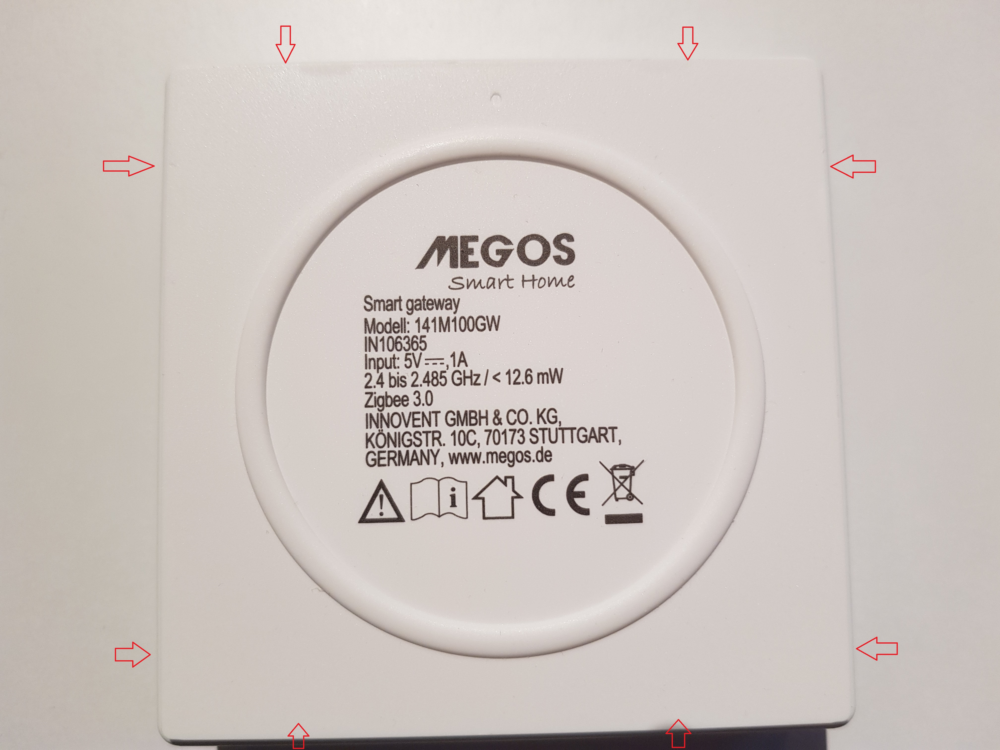
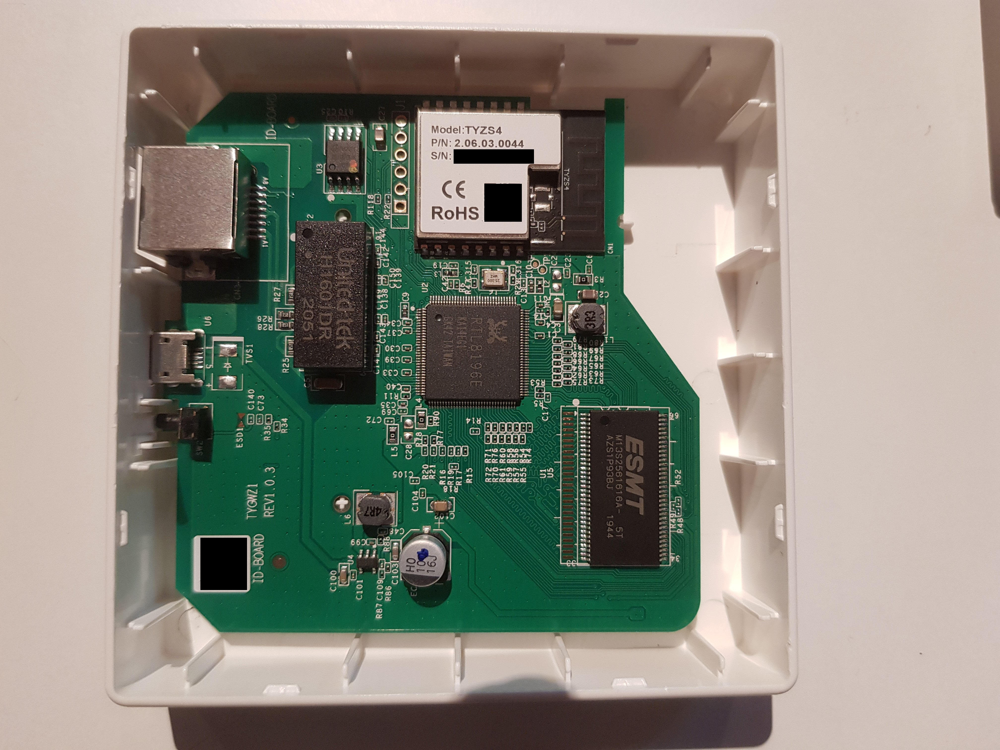
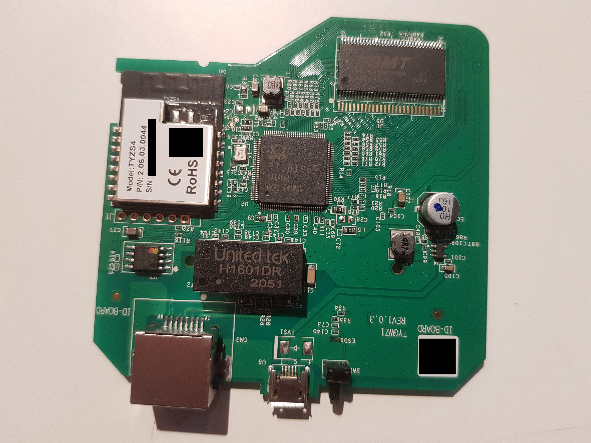
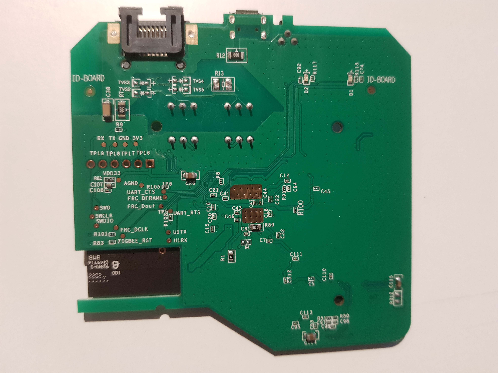
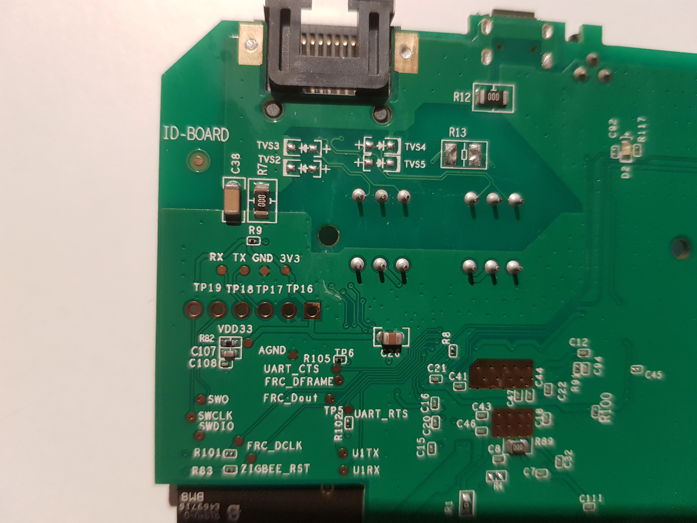

# MEGOS Smart Home 141M100GW

Top of the case (clips into bottom part of the case at the positions indicated by the red arrows):



PCB in case:



Top of PCB:



Bottom of PCB:



Testpoints and unpopulated pin header:



Pin assignment of unpopulated pin header:

* SWCLK
* SWDIO
* RX
* TX
* GND
* 3.3 V

BOM:

* Main SoC: Realtek RTL8196E, <https://www.realtek.com/en/products/communications-network-ics/item/rtl8196e>
* DRAM: ESMT M13S2561616A, <https://esmt.com.tw/upload/pdf/ESMT/datasheets/M13S2561616A(2S)_%20-40~85.pdf>
* Flash: ??
* Zigbee module: Tuya TYZS4, <https://developer.tuya.com/en/docs/iot/zigbeetyzs4module?id=K989rhycrz23f>

Baudrate serial console (pins TX, RX): 38400 baud


RS232 decoder 38400 baud:


Console output (38400 Baud, 8 bit, no parity, 1 stop bit):

```
Booting...

@@@@@@@@@@@@@@@@@@@@@@@@@@@@@@@@@@@@@@@@@@@@@@@@@@@@@@@@@@@@@@@@@@@@@@@@@@@@@@@@
@
@ chip__no chip__id mfr___id dev___id cap___id size_sft dev_size chipSize
@ 0000000h 0c84018h 00000c8h 0000040h 0000018h 0000000h 0000018h 1000000h
@ blk_size blk__cnt sec_size sec__cnt pageSize page_cnt chip_clk chipName
@ 0010000h 0000100h 0001000h 0001000h 0000100h 0000010h 000004eh GD25Q128
@
@@@@@@@@@@@@@@@@@@@@@@@@@@@@@@@@@@@@@@@@@@@@@@@@@@@@@@@@@@@@@@@@@@@@@@@@@@@@@@@@
DDR1:32MB

---RealTek(RTL8196E)at 2020.10.12-20:27+0800 v3.4T-pre2 [16bit](380MHz)
P0phymode=01, embedded phy
check_image_header  return_addr:05010000 bank_offset:00000000
no sys signature at 00010000!
P0phymode=01, embedded phy

---Ethernet init Okay!
tuya:start receive production test frame ...
Jump to image start=0x80c00000...
decompressing kernel:
Uncompressing Linux... done, booting the kernel.
done decompressing kernel.
start address: 0x80003780
Linux version 3.10.90 (dingsl@dingsl-pc) (gcc version 4.6.4 (Realtek RSDK-4.6.4                                                                                             Build 2080) ) #27 Mon Oct 12 20:33:38 CST 2020
CPU revision is: 0000cd01
Determined physical RAM map:
 memory: 02000000 @ 00000000 (usable)
Zone ranges:
  Normal   [mem 0x00000000-0x01ffffff]
Movable zone start for each node
Early memory node ranges
  node   0: [mem 0x00000000-0x01ffffff]
icache: 16kB/16B, dcache: 8kB/16B, scache: 0kB/0B
Built 1 zonelists in Zone order, mobility grouping on.  Total pages: 8128
Kernel command line:  console=ttyS0,38400 root=/dev/mtdblock2
PID hash table entries: 128 (order: -3, 512 bytes)
Dentry cache hash table entries: 4096 (order: 2, 16384 bytes)
Inode-cache hash table entries: 2048 (order: 1, 8192 bytes)
Memory: 27700k/32768k available (2479k kernel code, 5068k reserved, 525k data, 1                                                                                            92k init, 0k highmem)
SLUB: HWalign=32, Order=0-3, MinObjects=0, CPUs=1, Nodes=1
NR_IRQS:128
console [ttyS0] enabled
Calibrating delay loop... 378.47 BogoMIPS (lpj=1892352)
pid_max: default: 4096 minimum: 301
Mount-cache hash table entries: 512
reg e0=0
reg e1=0
reg e2=0
reg e3=0
reg e4=0
reg e5=0
reg e6=0
reg e7=0
reg f0=0
reg f1=0
reg f2=0
reg f3=0
reg f4=0
reg f5=0
reg f6=0
NET: Registered protocol family 16
bio: create slab <bio-0> at 0
NET: Registered protocol family 2
TCP established hash table entries: 512 (order: 0, 4096 bytes)
TCP bind hash table entries: 512 (order: -1, 2048 bytes)
TCP: Hash
 tables configured (established 512 bind 512)
TCP: reno registered
UDP hash table entries: 256 (order: 0, 4096 bytes)
UDP-Lite hash table entries: 256 (order: 0, 4096 bytes)
NET: Registered protocol family 1
squashfs: version 4.0 (2009/01/31) Phillip Lougher
jffs2: version 2.2. (NAND) © 2001-2006 Red Hat, Inc.
msgmni has been set to 54
Block layer SCSI generic (bsg) driver version 0.4 loaded (major 254)
io scheduler noop registered
io scheduler deadline registered
io scheduler cfq registered (default)
Serial: 8250/16550 driver, 2 ports, IRQ sharing disabled
serial8250: ttyS0 at MMIO 0x18002000 (irq = 9) is a 16550A
serial8250: ttyS1 at MMIO 0x18002100 (irq = 13) is a 16550A
Realtek GPIO Driver for Flash Reload Default
tuya_gpio_init ok, scan expire time:50
SPI INIT
 ------------------------- Force into Single IO Mode ------------------------
|No chipID  Sft chipSize blkSize secSize pageSize sdCk opCk      chipName    |
| 0 c84018h  0h 1000000h  10000h  10000h     100h   84    0          GD25Q128|
 ----------------------------------------------------------------------------
SPI flash(GD25Q128) was found at CS0, size 0x1000000
boot+cfg offset=0x0 size=0x20000 erasesize=0x10000
linux offset=0x20000 size=0x1e0000 erasesize=0x10000
rootfs offset=0x200000 size=0x200000 erasesize=0x10000
tuya-label offset=0x400000 size=0x20000 erasesize=0x10000
jffs2-fs offset=0x420000 size=0xbe0000 erasesize=0x10000
5 rtkxxpart partitions found on MTD device flash_bank_1
Creating 5 MTD partitions on "flash_bank_1":
0x000000000000-0x000000020000 : "boot+cfg"
0x000000020000-0x000000200000 : "linux"
0x000000200000-0x000000400000 : "rootfs"
0x000000400000-0x000000420000 : "tuya-label"
0x000000420000-0x000001000000 : "jffs2-fs"
PPP generic driver version 2.4.2
nf_conntrack version 0.5.0 (432 buckets, 1728 max)
ip_tables: (C) 2000-2006 Netfilter Core Team
TCP: cubic registered
NET: Registered protocol family 17
l2tp_core: L2TP core driver, V2.0
8021q: 802.1Q VLAN Support v1.8
Realtek FastPath:v1.03

Probing RTL819X NIC-kenel stack size order[1]...
eth0 added. vid=9 Member port 0x10f...
eth1 added. vid=8 Member port 0x10...
[peth0] added, mapping to [eth1]...
VFS: Mounted root (squashfs filesystem) readonly on device 31:2.
Freeing unused kernel memory: 192K (802f0000 - 80320000)
init started: BusyBox v1.13.4 (2020-10-12 20:25:36 CST)
Set power startcmd read


b8000038: 2794A104  0000000F    00000042  00000018    '¡        B
cmd write
Write memory 0xb8000038 dat 0x1794a104: 0x1794a104
Set power end
udhcpc (v1.13.4) started
Sending discover...

Please press Enter to activate this console. Tuya Gateway Application Normal Srart /tuya/tuya_start.sh UserAppRunDir:
set defult run_dir:/tuya
TY_ENV_APP_RUN_DIR=/tuya
get user cfg file error, load defult cfg file
load platform configure file:/tuya/def.cfg
start.conf is exist
udhcpc (v1.13.4) started
current run dir:/tuya/tuya_user1
Sending discover...
tuya_start_children.sh:UserAppRunDir:/tuya JsonFile Path:/tuya/def.cfg [engineer_mode: ]
killall: app_detect.sh: no process killed
killall: tyZ3Gw: no process killed
killall: log_detect.sh: no process killed
killall: process_monitor.sh: no process killed
Sending discover...
killall: tyZ3Gw: no process killed
cat: can't open '/tuya/eng_mode': No such file or directory
no eng file
Sending discover...
nlRecvFromAppSock sg_netlinkKeyPid:238
nlRecvFromAppSock port link sg_netlinkPid:238
Sending discover...
Sending discover...
Sending discover...
Sending discover...
Sending discover...
Sending discover...
```

Decode root password:

See <https://paulbanks.org/projects/lidl-zigbee/root.html>:

Press "ESC" while booting:

```
Booting...

@@@@@@@@@@@@@@@@@@@@@@@@@@@@@@@@@@@@@@@@@@@@@@@@@@@@@@@@@@@@@@@@@@@@@@@@@@@@@@@@
@
@ chip__no chip__id mfr___id dev___id cap___id size_sft dev_size chipSize
@ 0000000h 0c84018h 00000c8h 0000040h 0000018h 0000000h 0000018h 1000000h
@ blk_size blk__cnt sec_size sec__cnt pageSize page_cnt chip_clk chipName
@ 0010000h 0000100h 0001000h 0001000h 0000100h 0000010h 000004eh GD25Q128
@
@@@@@@@@@@@@@@@@@@@@@@@@@@@@@@@@@@@@@@@@@@@@@@@@@@@@@@@@@@@@@@@@@@@@@@@@@@@@@@@@
DDR1:32MB

---RealTek(RTL8196E)at 2020.10.12-20:27+0800 v3.4T-pre2 [16bit](380MHz)
P0phymode=01, embedded phy
check_image_header  return_addr:05010000 bank_offset:00000000
no sys signature at 00010000!

---Escape booting by user
P0phymode=01, embedded phy

---Ethernet init Okay!
<RealTek>LR 80000000 401802 16
Unknown command !
<RealTek>FLR 80000000 401802 16
Flash read from 00401802 to 80000000 with 00000016 bytes        ?
(Y)es , (N)o ? --> y
Flash Read Successed!
<RealTek>DW 80000000 4
80000000:       7E7E7E7E        7E7E7E7E        7E7E7E7E        7E7E7E7E
<RealTek>FLR 80000000 402002 32
Flash read from 00402002 to 80000000 with 00000032 bytes        ?
(Y)es , (N)o ? --> y
Flash Read Successed!
<RealTek>DW 80000000 8
80000000:       XXXXXXXX        XXXXXXXX        XXXXXXXX        XXXXXXXX
80000010:       XXXXXXXX        XXXXXXXX        XXXXXXXX        XXXXXXXX
<RealTek>
```

Decode root password using <https://paulbanks.org/download/files/lidl-zigbee/lidl_auskey_decode.py>

Login with root password:

```sh
tuya-linux login: root
Password:

Tuya Linux version 1.0
Jan  1 00:01:08 login[121]: root login on 'console'
# ls -Al /
drwxrwxr-x    2 1000     1000         1117 Oct 12  2020 bin
drwxr-xr-x    4 root     0               0 Jan  1 00:00 dev
drwxrwxr-x    4 1000     1000          189 Oct 12  2020 etc
drwxrwxr-x    2 1000     1000           33 Oct 12  2020 home
lrwxrwxrwx    1 1000     1000            8 Oct 12  2020 init -> bin/init
drwxrwxr-x    2 1000     1000          997 Oct 12  2020 lib
drwxrwxr-x    2 1000     1000            3 Oct 12  2020 mnt
dr-xr-xr-x   74 root     0               0 Jan  1 00:00 proc
lrwxrwxrwx    1 1000     1000            9 Oct 12  2020 root -> /var/root
drwxrwxr-x    2 1000     1000            3 Oct 12  2020 sbin
dr-xr-xr-x   11 root     0               0 Jan  1 00:00 sys
lrwxrwxrwx    1 1000     1000            8 Oct 12  2020 tmp -> /var/tmp
drwxr-xr-x    8 root     0               0 Jan  1 00:00 tuya
drwxrwxr-x    3 1000     1000           26 Oct 12  2020 usr
drwxr-xr-x   10 root     0               0 Jan  1 00:00 var
#
```

More info:

```sh
# mount
rootfs on / type rootfs (rw)
/dev/root on / type squashfs (ro,relatime)
proc on /proc type proc (rw,relatime)
ramfs on /var type ramfs (rw,relatime)
sysfs on /sys type sysfs (rw,relatime)
tmpfs on /dev type tmpfs (rw,relatime,size=64k,mode=0755)
/dev/mtdblock4 on /tuya type jffs2 (rw,relatime)
# ls -Al /tuya/
-rwxrwxr-x    1 1000     1000       195006 Oct 12  2020 NcpUpgrade.ota
-rwxrwxr-x    1 1000     1000         7707 Oct 12  2020 app_upgrade.sh
drwxrwxr-x    2 1000     1000            0 Jan  1 00:00 config
-rwxrwxr-x    1 1000     1000          453 Oct 12  2020 def.cfg
-rw-r--r--    1 root     0               1 Jan  1 00:00 grp_sce_flag_file
-rw-r--r--    1 root     0               0 Jan  1 00:00 grp_sce_save_bak_file
-rw-r--r--    1 root     0               0 Jan  1 00:00 grp_sce_save_file
-rw-rw-r--    1 1000     1000            0 Sep  4  2020 home_security_production_flag
-rwxrwxr-x    1 1000     1000         2161 Oct 12  2020 json_parser.sh
drwxr-xr-x    2 root     0               0 Jan  1 00:00 log_dir
-rw-r--r--    1 root     0               7 Jan  1 00:00 log_index_file
-rwxr-xr-x    1 root     0               0 Apr  6  2021 normal_dev_flag.ini
drwxr-xr-x    2 root     0               0 Apr  6  2021 rcdDb
drwxr-xr-x    2 root     0               0 Jan  1 00:00 ssh
-rwxrwxr-x    1 1000     1000          936 Oct 12  2020 ssh_monitor.sh
-rw-r--r--    1 root     0              32 Jan  1 00:00 start.conf
-rwxrwxr-x    1 1000     1000          639 Oct 12  2020 start_record.sh
-rw-r--r--    1 root     0            6313 Jan  1 00:00 start_record_file
-rwxrwxr-x    1 1000     1000          443 Oct 12  2020 tuya_net_start.sh
-rwxrwxr-x    1 1000     1000         4266 Oct 12  2020 tuya_start.sh
drwxrwxr-x    4 1000     1000            0 Jan  1 00:00 tuya_user1
-rwxrwxr-x    1 1000     1000       296748 Oct 12  2020 tuyadropbear
-rwxrwxr-x    1 1000     1000        39823 Oct 12  2020 tuyamtd
-rwxrwxr-x    1 1000     1000          882 Oct 12  2020 udhcpc.script
-rw-r--r--    1 root     0             307 Jan  1 00:00 zigbeeNetInfo.txt
-rw-r--r--    1 root     0             307 Jan  1 00:00 zigbeeNetInfo_bak.txt
-rw-r--r--    1 root     0               1 Jan  1 00:00 zigbee_net_valid_flag
# cat /etc/passwd
root:XXXXXXXXXXXXX:0:0:root:/:/bin/sh
# ps -ef
  PID USER       VSZ STAT COMMAND
    1 root      1292 S    init
    2 root         0 SW   [kthreadd]
    3 root         0 SW<  [ksoftirqd/0]
    4 root         0 SW   [kworker/0:0]
    5 root         0 SW<  [kworker/0:0H]
    6 root         0 SW   [kworker/u2:0]
    7 root         0 SW<  [khelper]
    8 root         0 SW<  [writeback]
    9 root         0 SW<  [bioset]
   10 root         0 SW<  [crypto]
   11 root         0 SW<  [kblockd]
   12 root         0 SW   [kswapd0]
   13 root         0 SW   [kworker/0:1]
   14 root         0 SW   [fsnotify_mark]
   20 root         0 SW   [mtdblock0]
   21 root         0 SW   [mtdblock1]
   22 root         0 SW   [mtdblock2]
   23 root         0 SW   [mtdblock3]
   24 root         0 SW   [mtdblock4]
   25 root         0 SW<  [deferwq]
   26 root         0 SW   [kworker/u2:1]
   27 root         0 SW<  [kworker/0:1H]
   96 root         0 SWN  [jffs2_gcd_mtd4]
  121 root      1296 S    -sh
  148 root      1288 S    udhcpc -i eth1 -s /tuya/udhcpc.script -p /var/run/udh
  216 root      1552 S    /tuya/tuyadropbear -P /var/run/dropbear.tuya.pid -p 2
  218 root      1288 S    /bin/sh ./app_detect.sh ./tyZ3Gw /tuya /tuya/def.cfg
  222 root      1296 S    /bin/sh ./log_detect.sh /tmp/tuya.log 60
  234 root      1292 S    /bin/sh ./process_monitor.sh /tuya /tuya/def.cfg
  238 root      7992 S    ./tyZ3Gw /tuya/tuya_user1 /tuya/def.cfg
  253 root      7992 S    ./tyZ3Gw /tuya/tuya_user1 /tuya/def.cfg
  254 root      7992 S    ./tyZ3Gw /tuya/tuya_user1 /tuya/def.cfg
  255 root      7992 S    ./tyZ3Gw /tuya/tuya_user1 /tuya/def.cfg
  256 root      7992 S    ./tyZ3Gw /tuya/tuya_user1 /tuya/def.cfg
  257 root      7992 S    ./tyZ3Gw /tuya/tuya_user1 /tuya/def.cfg
  258 root      7992 S    ./tyZ3Gw /tuya/tuya_user1 /tuya/def.cfg
  259 root      7992 S    ./tyZ3Gw /tuya/tuya_user1 /tuya/def.cfg
  260 root      7992 S    ./tyZ3Gw /tuya/tuya_user1 /tuya/def.cfg
  261 root      7992 S    ./tyZ3Gw /tuya/tuya_user1 /tuya/def.cfg
  262 root      7992 S    ./tyZ3Gw /tuya/tuya_user1 /tuya/def.cfg
  268 root      7992 S    ./tyZ3Gw /tuya/tuya_user1 /tuya/def.cfg
  269 root      7992 S    ./tyZ3Gw /tuya/tuya_user1 /tuya/def.cfg
  270 root      7760 S    ./tyZ3Gw /tuya/tuya_user1 /tuya/def.cfg
  271 root      7992 S    ./tyZ3Gw /tuya/tuya_user1 /tuya/def.cfg
  272 root      7760 S    ./tyZ3Gw /tuya/tuya_user1 /tuya/def.cfg
  273 root      7760 S    ./tyZ3Gw /tuya/tuya_user1 /tuya/def.cfg
  278 root      7992 S    ./tyZ3Gw /tuya/tuya_user1 /tuya/def.cfg
  279 root      7992 S    ./tyZ3Gw /tuya/tuya_user1 /tuya/def.cfg
  284 root      7992 S    ./tyZ3Gw /tuya/tuya_user1 /tuya/def.cfg
  285 root      7992 S    ./tyZ3Gw /tuya/tuya_user1 /tuya/def.cfg
  286 root      7992 S    ./tyZ3Gw /tuya/tuya_user1 /tuya/def.cfg
  287 root      7992 S    ./tyZ3Gw /tuya/tuya_user1 /tuya/def.cfg
  288 root      7992 S    ./tyZ3Gw /tuya/tuya_user1 /tuya/def.cfg
  289 root      7992 S    ./tyZ3Gw /tuya/tuya_user1 /tuya/def.cfg
  290 root      7992 S    ./tyZ3Gw /tuya/tuya_user1 /tuya/def.cfg
  292 root      7992 S    ./tyZ3Gw /tuya/tuya_user1 /tuya/def.cfg
  296 root      7992 S    ./tyZ3Gw /tuya/tuya_user1 /tuya/def.cfg
  297 root      7992 S    ./tyZ3Gw /tuya/tuya_user1 /tuya/def.cfg
  362 root      1280 S    sleep 60
  366 root      1280 S    sleep 20
  368 root      1288 R    ps -ef

# ifconfig
eth1      Link encap:Ethernet  HWaddr XX:XX:XX:XX:XX:XX
          inet addr:192.168.1.254  Bcast:192.168.1.255  Mask:255.255.255.0
          UP BROADCAST RUNNING MULTICAST  MTU:1500  Metric:1
          RX packets:0 errors:0 dropped:0 overruns:0 frame:0
          TX packets:0 errors:0 dropped:0 overruns:0 carrier:0
          collisions:0 txqueuelen:0
          RX bytes:0 (0.0 B)  TX bytes:0 (0.0 B)
          Interrupt:12

lo        Link encap:Local Loopback
          inet addr:127.0.0.1  Mask:255.0.0.0
          UP LOOPBACK RUNNING  MTU:65536  Metric:1
          RX packets:636 errors:0 dropped:0 overruns:0 frame:0
          TX packets:636 errors:0 dropped:0 overruns:0 carrier:0
          collisions:0 txqueuelen:0
          RX bytes:465839 (454.9 KiB)  TX bytes:465839 (454.9 KiB)
```
